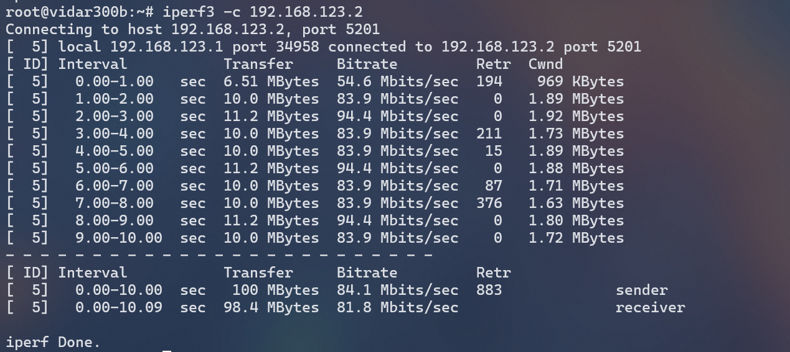

# udp2mctcp

transports UDP packets in multi-connection TCP.

Designed for tunnel ip over tcp.

## Usage

udp2mctcp 与 mctcp2udp 需要成对使用，

```bash
./udp2mctcp -l 127.0.0.1:12345 -f <host:peer_port>
./mctcp2udp -l <0.0.0.0:listen_port> -f <udp_host:udp_port>
```

## Example

如果中间需要代理，可以搭配 gost 使用

```bash
./udp2mctcp -l 127.0.0.1:12345 -f 127.0.0.1:12346
./gost -L=tcp://127.0.0.1:12346/<remote_host>:<remote_port> -F=socks5://<socks5_host>:<socks5_port>
./mctcp2udp -l <0.0.0.0:listen_port> -f <udp_host>:<udp_port>
```

## SpeedTest

经过测试，原速率为 2-4Mbps 的链路使用 32 个 TCP 连接的 mctcp 替换单线 tcp 测得到 iperf3 60-100 Mbps

iperf(tcp) over wireguard over mctcp over sock5

> iperf -> wireguard -> udp2mctcp -> gost -> socke5 server -> mctcp2udp -> wireguard -> iperf
> 
> 